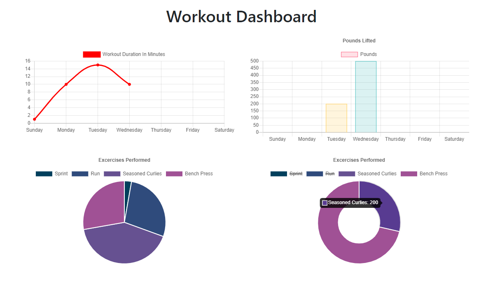

# MongoDB Fitness Tracker

  
## Testing
  

  
---
  
## Description 
An application with which the user can enter workout data. The user can also see their overall workout stats visualized in the dashboard tab.
                      
--- 
                      
## Table of Contents
                      
                      
* [Installation](#installation)
* [Contributing](#contributing)
* [License](#license)
* [Questions](#questions)
                      
---
                      
## Installation/Usage
                      
Simply visit the [Heroku](https://young-thicket-31737.herokuapp.com/) link and start logging your workouts!
If you would like to download the application or check out the code, visit my [GitHub Profile](https://github.com/markmckenna37) and clone the repo to a local directory. You will also need "Node.js" installed. Simply change into the cloned repo, type "npm install", followed by "node server.js", then go to http://localhost:8080/, and start tracking!
                                           
---
                      
## Contributing
                      
Mark McKenna
                      
---
                      
## License
                      
This project is licensed under MIT.
  
Copyright (c) [2020] [Mark McKenna]
  
                      
---
                                                         
## Questions
Have any questions or contributions? Check out my [GitHub Profile](https://github.com/markmckenna37)                 
Or you can email me at <markmckenna37@gmail.com>.
                      
---
                      
## Tests
                      

